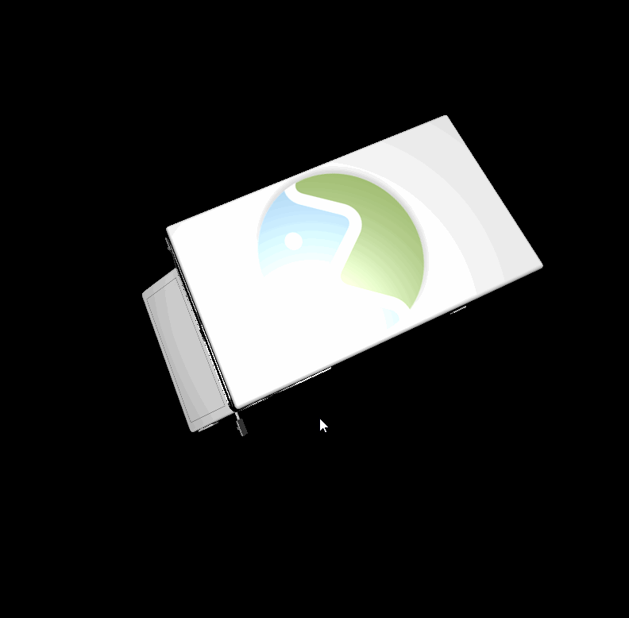
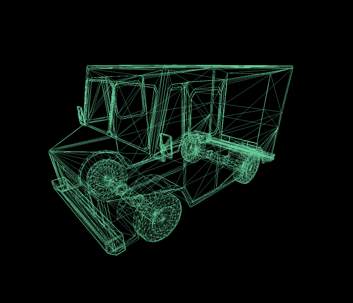
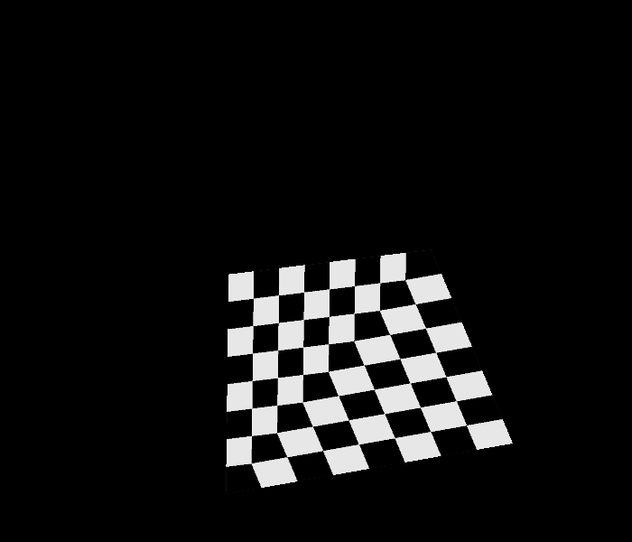
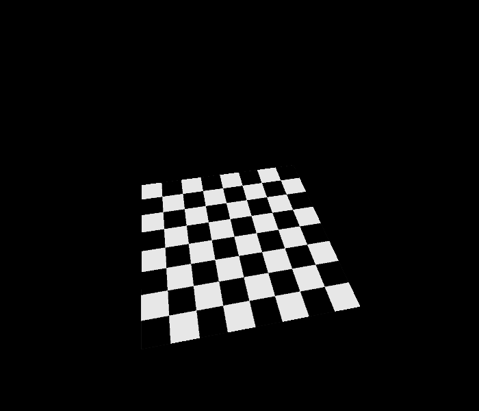

CUDA Rasterizer
===============

**University of Pennsylvania, CIS 565: GPU Programming and Architecture, Project 2**

* Jizhou Yan
* Tested on: Windows 10, i7-4789K @ 4.00GHz 32GB, GTX 1080Ti(Personal Desktop)

## Features
* Rasterization
* Blinn-Phong shading
* Texture mapping with bilinear filter and perspective correct texture coordinates
* Rasterization for points and lines 

## Overview

  # Pipeline: 
	* Vertex Shading (apply Model, View, Projection transform and assembly vertexOut )
	* Primitive Assembly (assembly vertices to primitives)
	* Rasterization (fill in every fragment inside each primitive)
	* Fragment Shading (apply fragment shading using pos, nor and texCoords information, BlinnPhong shading applied)
	* Write Fragment Buffer to Frame Buffer (send current frame to display)

## Result

  # Rasterization of Line and Point
	|point|wireframe|
	|----|----|
	|||

	|point|wireframe|
	|----|----|
	|||

  # Perspective Correction
	|without perspective correction|with perspective correction|
	|----|----|
	|||

